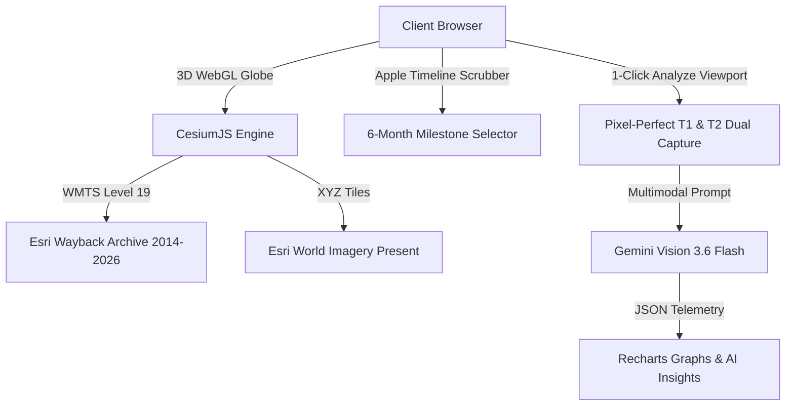

<div align="center">
  

  # 🌍 Earth Query Lens
  **Multimodal Geospatial AI & High-Resolution Bi-Temporal Satellite Intelligence**

  [](#)
  [](#)
  [](#)
  [](#)
  [](#)
  [](#)

  <br />

  <!-- Animated Typing SVG -->
  <a href="#">
    
  </a>
</div>

---

## 🌟 Highlights

**Earth Query Lens** is an advanced, client-side conversational AI and 3D geospatial platform for satellite imagery analysis. It bridges **CesiumJS 3D WebGL globes**, **Esri World Imagery Wayback archives (2014–2026)**, and **Multimodal Gemini Vision models** to deliver instant environmental insights and bi-temporal change detection directly in your browser.

> [!TIP]
> **100% Free & Open — Zero Credit Card Required**: All satellite basemaps and historical archives stream directly from public-domain, zero-token open tile repositories (Esri World Imagery Wayback). No sign-up, no tokens, and no charges.

---

## ✨ Key Features

### 🍏 1. Apple-Inspired Timeline Scrubber (6-Month Cadence)
- **12+ Year Seamless High-Res Archive:** Stream crystal-clear sub-meter imagery across 26 distinct milestones from **2014 to 2026**.
- **Smooth 6-Month Stepping:** Effortlessly scrub through time with an Apple-style range slider or step forward/back with precision `<` and `>` controls.
- **Instant Year Presets:** Jump straight to **2014 (12y ago)**, **2017 (9y ago)**, **2020 (6y ago)**, or **2023 (3y ago)**.
- **Zero Orbital Swath Gaps:** Unlike raw daily orbital sensors, Wayback provides seamless, cloud-filtered, composite satellite photography across every continent.

### 🪟 2. Precision Bi-Temporal Split View Curtain
- **Hardware-Accelerated Shaders:** Powered by Cesium's native `SplitDirection` viewport shaders for silky smooth real-time split-screen comparison.
- **Ergonomic Glass Grabber:** Drag the Apple-style center slider to reveal the selected historical era (T1) on the left and present day (T2) on the right.
- **Sub-Meter Zoom Detail:** Zoom in to street level, neighborhoods, lakes, forests, or airports—imagery remains razor sharp down to individual houses and roads (up to zoom level 19).

### ⚡ 3. 1-Click Automatic Zoomed View Capture (Zero Drawing Needed!)
- **Zero Drawing Friction:** No need to manually drag bounding boxes. Simply zoom and pan the 3D globe to any city or region.
- **Pixel-Perfect Viewport Dual-Capture:** Click **"Analyze Zoomed View in AI"** to automatically capture two full-frame, unclipped high-res images:
  - **Frame 1 (T1 Baseline):** Historical Wayback view for the chosen era.
  - **Frame 2 (T2 Observation):** Contemporary present-day view.
- **Direct AI Staging:** Staged into chat with pre-filled bitemporal queries and sent to Gemini Vision for automated analysis.

### 📊 4. Deep Telemetry & Comparative Analytics
- **Visual Evidence Fusion:** Highlights verified environmental changes with confidence scoring.
- **Interactive Multi-View Charts:**
  - 📊 **Comparative Bar Chart:** Side-by-side metric comparison (Vegetation, Urban, Water, Barren terrain).
  - 📈 **Spline Curves:** Smooth trajectory lines tracking pre- vs post-event land cover percentages.
  - 🧭 **Polar Radar Graph:** High-dimensional visualization of ecosystem shifts.
- **Bounding Box Grounding:** Precise interactive feature boxes rendered over satellite captures.

### 🌐 5. Multilingual Cosmic Interface
- Full localization for **English**, **हिन्दी (Hindi)**, and **ಕನ್ನಡ (Kannada)**.
- Cosmic glassmorphic theme with real-time GPS live location zooming.

---

## 🛰️ Open Satellite Providers (Zero Cost)

| Provider | Coverage | Resolution | History | Swath Lines? | Credit Card? |
| :--- | :--- | :--- | :--- | :---: | :---: |
| **Esri Wayback (2014–2026)** | Global Seamless | **Sub-meter / Level 19** | **2014 – Present (12 yrs)** | ❌ None | ❌ None |
| **Esri World Imagery (Current)** | Global Seamless | **Sub-meter / Level 19** | Contemporary | ❌ None | ❌ None |
| **Esri Reference Places** | Global Overlays | Vector / Tile Labels | Contemporary | ❌ None | ❌ None |

---

## 📐 Architecture



### Tech Stack
- **Framework:** React 19 + Vite 6 + TanStack Router
- **3D Geospatial Engine:** CesiumJS 1.145 + Resium
- **Data Layers:** Esri World Imagery Wayback (26 Milestones, WMTS) + Esri Reference Overlay
- **AI & Vision:** Google Gemini API (`gemini-3.6-flash` / multimodal vision fallback chain)
- **Styling & UI:** Tailwind CSS v4 + Radix UI + Lucide Icons
- **Data Visualization:** Recharts (Radar, Spline, Bar charts)
- **Client Processing:** `html2canvas` + `geotiff.js` (client-side TIFF/SAR decoding)

---

## 🚀 Quick Start

### 1. Clone & Install
```bash
git clone https://github.com/YOUR_USERNAME/earth-query-lens.git
cd earth-query-lens
npm install
```

### 2. Configure Environment
Create a `.env.local` file in the project root:
```env
VITE_GEMINI_API_KEY=AIzaSy_YOUR_KEY_HERE
```
*(You can also configure the Gemini API key directly in the web UI via the Settings modal).*

### 3. Run Development Server
```bash
npm run dev
```
Open your browser at `http://localhost:5173`.

---

## 🎮 How to Use Bi-Temporal Change Detection

1. **Open the Map:** Click on the **"Map"** tab in the top navigation or sidebar.
2. **Enable Bi-Temporal Mode:** Click the **"Bi-Temporal Timeline"** button in the bottom control bar.
3. **Scrub the Timeline:**
   - Use the Apple-inspired scrubber at the top to slide across 2014–2026 in 6-month steps.
   - Or click one of the quick presets (**2014**, **2017**, **2020**, **2023**).
4. **Inspect the Landscape:**
   - Pan & zoom directly to any neighborhood, city, lake, or forest (e.g., Dubai Palm Jumeirah, Lake Mead, Mysuru, Bengaluru).
   - Drag the center split curtain back and forth to inspect the transformation at street level!
5. **1-Click AI Analysis:**
   - Simply click **"Analyze Zoomed View in AI"** at the bottom of the map.
   - The app automatically captures pixel-perfect high-resolution frames of your current zoom across both eras and routes you to the chat.
6. **Review Insights:** The AI automatically quantifies urban growth, vegetation shifts, and water body dynamics with radar, spline, and bar telemetry charts!

---

## 📦 Production Build & Deployment

This project is optimized for zero-config Vercel deployment:
```bash
npm run build
npm run preview
```

### Deploy to Vercel:
1. Push your repository to GitHub.
2. Import into [Vercel](https://vercel.com).
3. Set the environment variable `VITE_GEMINI_API_KEY`.
4. Deploy!

---

<div align="center">
  <sub>Built with ❤️ for Earth Observation, Disaster Response, and Environmental Conservation.</sub>
</div>
