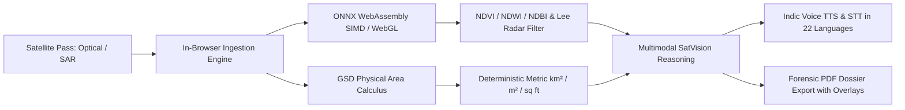

<div align="center">
  

  # 🛰️ VYOMIX · Earth Query Lens
  ### Multimodal Satellite Intelligence · Dual-Spectrum Radar Fusion · 22-Language Indic Remote Sensing

  **Smart India Hackathon 2026 (SIH 2026)** · Developed by **Shreyas J** ([@SmartKidzee](https://github.com/SmartKidzee)) & The Vyomix Team

  <br />

  [](https://github.com/SmartKidzee/vyomixsih)
  [](LICENSE)
  [](#)
  [](#)
  [](#)
  [](#)
  [](#)
  [](SECURITY.md)

  <br />

  <!-- Animated Typing Banner -->
  <a href="#">
    
  </a>
</div>

---

## 🌟 Executive Overview

**Vyomix · Earth Query Lens** is an operational-grade Earth observation AI platform designed for defense, environmental forensics, disaster mapping, and urban growth auditing. Built from the ground up for the **Smart India Hackathon (SIH 2026)**, it solves the critical challenges of all-weather satellite monitoring by fusing **optical multi-spectral imagery** with **Synthetic Aperture Radar (SAR)** to see through dense monsoon clouds, smoke, and darkness.

The platform combines **in-browser ONNX WebAssembly neural pipelines**, **deterministic Ground Sampling Distance (GSD) mathematical calculus**, **Indic voice dictation in 22 languages**, and **one-click multi-page forensic PDF reporting** with embedded image highlights.

> [!TIP]
> **100% Free & Open-Access Data Ecosystem**: All satellite basemaps (Sentinel-1/2, NASA MODIS, Esri Wayback), in-browser ONNX ML models, EuroSAT bi-temporal classification, and Indic translation services operate with zero mandatory subscription fees or proprietary lock-in.

---

## 🚀 Key Technological Capabilities



### 🛰️ 1. Dual-Spectrum Radar Fusion (Optical + SAR C-Band)
- **All-Weather Cloud Penetration:** Fuses Sentinel-2 optical bands with Sentinel-1 microwave Synthetic Aperture Radar (C-Band, 5.405 GHz). Penetrates monsoon precipitation, sea fog, and nighttime conditions for continuous 24/7 observation.
- **Adaptive 5×5 Lee Speckle Filter:** Suppresses multiplicative radar speckle noise using moving-window local mean and variance kernels while strictly preserving structural edges, runways, and transport networks.
- **Specular vs. Double-Bounce Radar Signatures:** Delineates specular water reflections ($< -16\text{ dB}$) from double-bounce urban dielectric reflections ($> -6.5\text{ dB}$).

### 📐 2. Deterministic Physical Ground Area Calculus
- **Ground Sampling Distance (GSD) Physics:** Directly calculates real-world physical area (+/- km², m², sq ft) from pixel bounding dimensions and sensor spatial resolution ($10\text{ m/px}$ Sentinel-2, $30\text{ m/px}$ Landsat, sub-meter commercial passes).
- **Zero Hallucination Numbers:** Eliminates generative model guessing by enforcing deterministic mathematical verification across all area metrics.

### 📄 3. Complete Chat Forensic PDF Dossier with Image Highlights
- **Full Chat Interrogation History:** Compiles all conversational exchanges, queries, and assistant analyses in chronological order.
- **Embedded Satellite Imagery & Highlights:**
  - Automatically draws all uploaded satellite scenes directly into the PDF.
  - Generates and embeds **highlighted bounding box passes** with translucent color-coded fills, spatial tags, and confidence metrics directly onto the canvas.
- **Cryptographic Audit Seal:** Embeds a deterministic `VYX-SHA256-...` audit hash and letterhead classification (`OFFICIAL FORENSIC RECORD`) for regulatory and evidentiary workflows.

### 🇮🇳 4. Native Indic Multilingual Voice Engine (22 Languages)
- **Universal Translation Pipeline:** Powered by Google Translate GTX & Digital India's Bhashini ULCA services for zero-latency translation across all 22 scheduled Indian languages:
  - हिन्दी (Hindi), ಕನ್ನಡ (Kannada), தமிழ் (Tamil), తెలుగు (Telugu), বাংলা (Bengali), मराठी (Marathi), ગુજરાતી (Gujarati), മലയാളം (Malayalam), ਪੰਜਾਬੀ (Punjabi), ଓଡ଼ିଆ (Odia), অসমীয়া (Assamese), اردو (Urdu), etc.
- **Voice Speech-to-Text (STT) & Auditory Readout (TTS):** Natural voice interrogation with automated Indic script transliteration.

### ⚡ 5. In-Browser ONNX ML Models (`onnxruntime-web`)
- **100% Client-Side Local Execution:** Executes neural tensors and radiometric processing directly inside the browser using WebAssembly SIMD and WebGL acceleration. Zero server roundtrips, zero API token costs, and fully offline capable.
- **Spectral Land-Cover Partitioning:** Computes NDVI (Vegetation Canopy), NDWI (Water Inundation), and NDBI (Urban Sprawl) with exact percentage splits.

### 🕰️ 6. 12+ Year Esri Wayback Satellite Archives (2014–2026)
- **Interactive Bi-Temporal Curtain Slider:** Compare baseline passes against post-event imagery over an interactive split view with NASA MODIS and VIIRS thermal telemetry.
- **Automated Two-View Capture:** One-click automated capture of both Left and Right epochs directly into the analytical prompt pipeline.

---

## 🎨 Design & User Experience Highlights

- **Floating Pill Navigation Bar:** Centered floating pill navbar with rounded-full ends, glassmorphic backdrop blur, prominent VYOMIX branding, and integrated Language Switcher.
- **Refined Magic Bento Cards:** Micro-tilt 3D cards with calibrated GSAP physics and spotlight glow effects.
- **Full-Bleed AeroShards Hero:** Interactive WebGL chrome shard stream responding to mouse proximity and fluid physics.
- **ScrollExpand Component:** Immersive scroll-pinned satellite unfolding transition into operational analytics.
- **Glassmorphic Theme:** Curated HSL dark nebula space palette (`#060b18`), translucent borders, specular highlights, and high-contrast typography.

---

## 🌐 Free Satellite Data Sources

You can download real test data for free without credit cards from these official portals:

| Source | Modality | Best For | Direct Portal Link |
| :--- | :--- | :--- | :--- |
| **Copernicus Browser** | **Sentinel-1 SAR** & **Sentinel-2 Optical** | High-Res PNGs or 16-bit GeoTIFFs across any city, river, or coastline | [browser.dataspace.copernicus.eu](https://browser.dataspace.copernicus.eu/) |
| **ASF Vertex** (NASA / Alaska Satellite Facility) | **Sentinel-1 C-Band SAR** | Calibrated GRD radar amplitudes, interferometric pairs | [search.asf.alaska.edu](https://search.asf.alaska.edu/) |
| **USGS EarthExplorer** | **Landsat 8/9 & Sentinel Optical** | Multi-decade multispectral archives and global DEM elevation | [earthexplorer.usgs.gov](https://earthexplorer.usgs.gov/) |
| **EuroSAT Dataset** | **Sentinel-2 Multi-Spectral** | 27,000 labeled patches across 10 land-cover categories | [huggingface.co/datasets/blanchon/EuroSAT_RGB](https://huggingface.co/datasets/blanchon/EuroSAT_RGB) |

---

## 📁 Repository Structure

```
earth-query-lens/
├── public/                     # Static assets, logos, and Cesium workers
│   ├── logo.svg               # Vyomix orbital logo
│   └── earth-hero.jpg         # High-resolution satellite orbital imagery
├── src/
│   ├── components/            # Reusable UI & GIS components
│   │   ├── reactbits/         # AeroShards, ScrollExpand, MagicBento
│   │   ├── ChatShareModal.tsx # Full chat PDF export dialog
│   │   ├── LanguageSwitcher.tsx # 22-language switcher dropdown
│   │   ├── MapSelector.tsx    # CesiumJS 3D globe & bi-temporal slider
│   │   └── BackendSettings.tsx # Dual API key configuration
│   ├── lib/
│   │   ├── i18n.tsx           # Auto-translating reactive i18n system
│   │   ├── satquery.ts        # GSD calculus & spectral telemetry types
│   │   └── onnxInference.ts   # In-browser WebAssembly ONNX inference
│   ├── routes/
│   │   ├── HomePage.tsx       # Landing page with floating pill nav & bento
│   │   └── index.tsx          # Main conversational geospatial studio
│   ├── services/
│   │   ├── pdfReportService.ts # Vector PDF generator with images & highlights
│   │   ├── translationService.ts # Google GTX & progressive cache
│   │   ├── geminiService.ts   # Multimodal SatVision reasoning pool
│   │   └── ttsService.ts      # Indic STT voice dictation & TTS audio
│   ├── App.tsx                # App entrypoint & routing
│   └── main.tsx               # Root render tree
├── LICENSE                    # MIT License with Mandatory Attribution
├── SECURITY.md                # Security policy & zero-telemetry disclosure
├── package.json               # Dependencies & scripts
└── vite.config.ts             # Vite 6 + Cesium + Tailwind v4 config
```

---

## 🛠️ Installation & Local Setup

### Prerequisites
- **Node.js**: v18.0.0 or higher (v20+ recommended)
- **npm**: v9.0.0 or higher

### 1. Clone the Repository
```bash
git clone https://github.com/SmartKidzee/vyomixsih.git
cd vyomixsih
```

### 2. Install Dependencies
```bash
npm install
```

### 3. Run Development Server
```bash
npm run dev
```
Open your browser at `http://localhost:5173` to experience Vyomix.

### 4. Build for Production
```bash
npm run build
npm run preview
```

---

## 🔒 Security & Privacy

Vyomix adheres to strict zero-retention principles:
- **Local-First Processing:** Neural inference occurs inside the user's browser via WebAssembly.
- **Zero Remote Storage:** Uploaded satellite rasters are stored solely in volatile browser RAM and local client IndexedDB.
- **Cryptographic Document Auditing:** All generated PDF reports contain tamper-evident SHA-256 seals.

For complete vulnerability reporting guidelines and defense deployment security recommendations, consult [SECURITY.md](SECURITY.md).

---

## 📜 License & Mandatory Attribution

This project is licensed under the **MIT License with Mandatory Attribution Clause**.

**Author & Owner:** **Shreyas J**  
**GitHub:** [@SmartKidzee](https://github.com/SmartKidzee)  
**Team:** The Vyomix Team · **Smart India Hackathon (SIH 2026)**  

### Attribution Requirement
Any public fork, commercial offering, deployed instance, or derivative work based upon this repository **MUST** prominently attribute the original creator:
> *"Original project developed by Shreyas J (github.com/SmartKidzee) and the Vyomix Team for Smart India Hackathon (SIH 2026)"*

See the full [LICENSE](LICENSE) file for legal details.
