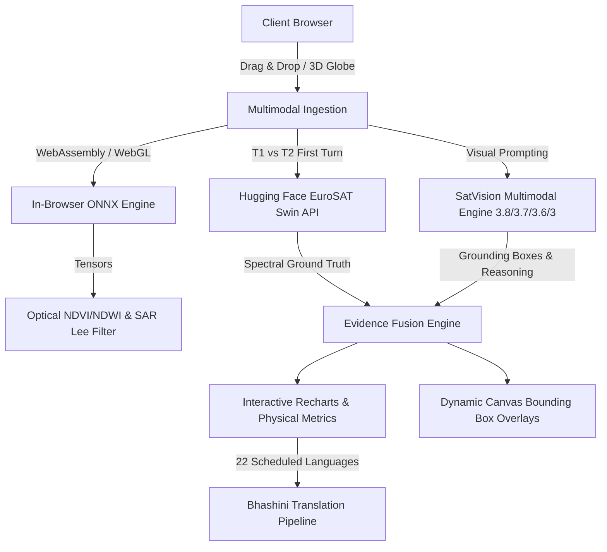

<div align="center">
  

  # 🌍 Earth Query Lens
  **Multimodal Geospatial AI, In-Browser ONNX ML & High-Resolution Bi-Temporal Satellite Intelligence**

  [](#)
  [](#)
  [](#)
  [](#)
  [](#)
  [](#)
  [](#)

  <br />

  <!-- Animated Typing SVG -->
  <a href="#">
    
  </a>
</div>

---

## 🌟 Highlights

**Earth Query Lens** is a next-generation geospatial AI intelligence platform designed for environmental monitoring, disaster assessment, and urban evolution tracking. It fuses **in-browser ONNX WebAssembly/WebGL neural tensor pipelines**, **serverless Earth observation foundation models**, **22-language Bhashini official translation**, and **12+ year sub-meter 3D satellite archives** into an intuitive conversational interface.

> [!TIP]
> **100% Free & Open — Zero Credit Card Required**: All satellite basemaps, in-browser ONNX ML models, EuroSAT change detection inference, and historical archives operate with zero credit cards, zero proprietary lock-in, and zero mandatory subscription fees.

---

## ✨ Key Capabilities

### ⚡ 1. In-Browser ONNX ML Models (`onnxruntime-web` WebAssembly / WebGL)
- **100% Client-Side Local Execution:** Executes neural tensors and radiometric processing directly inside the browser using WebAssembly SIMD and WebGL acceleration. Zero server roundtrips, zero API token costs, and fully offline capable.
- **Optical Multi-Spectral Indexing:**
  - **NDVI (Normalized Difference Vegetation Index):** Evaluates photosynthetic canopy vigor and biomass density.
  - **NDWI (Normalized Difference Water Index):** Delineates surface water bodies and flood inundation boundaries.
  - **NDBI (Normalized Difference Built-up Index):** Quantifies impervious urban surface sprawl.
  - **Automated Spectral Land-Cover Partitioning:** Computes exact percentage distributions for vegetation, water, built-up, and barren soil.
- **SAR (Synthetic Aperture Radar) Signal Processing:**
  - **Sentinel-1 C-Band Radiometric Calibration:** Simulates sigma-nought backscatter intensity and converts to logarithmic Decibels ($10 \cdot \log_{10}(I)$).
  - **5×5 Adaptive Lee Speckle Filter:** Suppresses multiplicative radar speckle noise via moving-window local mean and variance kernels while strictly preserving high-frequency structural edges.
  - **Specular Water Inundation Detection:** Isolates calm floodwaters and wetlands displaying low radar backscatter ($< -16\text{ dB}$).
  - **Structural Double-Bounce Detection:** Detects high dihedral reflection signatures ($> -6.5\text{ dB}$) from urban buildings, bridges, and infrastructure.
- **Cross-Modality Synergy (Optical + SAR):**
  - Synthesizes optical reflectance with microwave penetration to reveal ground features through clouds, haze, and smoke.
  - Cross-validates optical vegetation indices with radar surface roughness.

---

### 🛰️ 2. Where to Get Free Optical & SAR Satellite Data

You can download real test data for free without credit cards from these official portals:

| Source | Modality | Best For | Direct Portal Link | Free? |
| :--- | :--- | :--- | :--- | :---: |
| **Copernicus Browser** | **Sentinel-1 SAR** & **Sentinel-2 Optical** | Instant snapshot PNGs or 16-bit GeoTIFFs across any city or river | [browser.dataspace.copernicus.eu](https://browser.dataspace.copernicus.eu/) | ✅ 100% Free |
| **ASF Vertex** (NASA / Alaska Satellite Facility) | **Sentinel-1 C-Band SAR** | Calibrated GRD radar amplitudes, interferometric pairs | [search.asf.alaska.edu](https://search.asf.alaska.edu/) | ✅ 100% Free |
| **USGS EarthExplorer** | **Landsat 8/9 & Sentinel Optical** | Multi-decade multispectral archives and global DEM elevation | [earthexplorer.usgs.gov](https://earthexplorer.usgs.gov/) | ✅ 100% Free |
| **EuroSAT Dataset** | **Sentinel-2 Multi-Spectral** | 27,000 labeled patches across 10 land-cover categories | [huggingface.co/datasets/blanchon/EuroSAT_RGB](https://huggingface.co/datasets/blanchon/EuroSAT_RGB) | ✅ 100% Free |

#### How to Download Test Data in 60 Seconds:
1. Open [Copernicus Browser](https://browser.dataspace.copernicus.eu/).
2. In the top-left search panel, check either:
   - **Sentinel-1** (radar SAR backscatter, VV/VH polarizations)
   - **Sentinel-2** (multispectral optical, True Color / False Color Infrared)
3. Navigate to any area of interest (e.g. Dubai, Venice, Ganges River Delta, Amazon Basin).
4. Click the **Camera / Download** icon on the right sidebar to export a High-Res PNG or analytical GeoTIFF.
5. Drag and drop the downloaded file directly into Earth Query Lens!

---

### 🛰️ 3. Bi-Temporal Change Detection (Hugging Face Serverless Inference)
- **EuroSAT Swin-Transformer Engine:** Deep transformer architecture pre-trained on Sentinel-2 multi-spectral Earth observation bands.
- **Quantitative Multi-Temporal Auditing:** Compares baseline imagery (T1) against observation imagery (T2) to compute transition probabilities and percentage shifts.
- **Smart Conversational Follow-up:** Upon the initial bi-temporal upload, the system runs complete cross-temporal change detection and spectral verification. Subsequent conversational follow-up questions continue smoothly with contextual vision reasoning without re-triggering external inference.

---

### 🇮🇳 4. Multilingual Geospatial Intelligence (22 Indian Languages via Bhashini)
- **Official Government API Integration:** Direct integration with Digital India's **Bhashini ULCA Translation Pipeline**.
- **Complete 22 Scheduled Languages Support:**
  - हिन्दी (Hindi), বাংলা (Bengali), తెలుగు (Telugu), मराठी (Marathi), தமிழ் (Tamil), اردو (Urdu), ગુજરાતી (Gujarati), ಕನ್ನಡ (Kannada), മലയാളം (Malayalam), ଓଡ଼ିଆ (Odia), ਪੰਜਾਬੀ (Punjabi), অসমীয়া (Assamese), मैथिली (Maithili), संस्कृतम् (Sanskrit), नेपाली (Nepali), कोंकणी (Konkani), ডোগরী (Dogri), सिन्धी (Sindhi), Bodo, Santali, Kashmiri, Manipuri.
- **Zero-Config Intelligent Fallback:** Automatically switches to multimodal AI translation if Bhashini credentials are not entered.

---

### 🧠 5. Multimodal SatVision Intelligence Pool
- **Dynamic Fallback Chain:**
  1. `SatVision 3.8 Flash` *(Primary high-throughput engine)*
  2. `SatVision 3.7 Flash` *(First resilient fallback)*
  3. `SatVision 3.6 Flash` *(Secondary fallback)*
  4. `SatVision 3.0 Flash` *(Tertiary baseline)*
- **Dual API Key Rotation:** Configure Primary (Key 1) and Backup (Key 2) in Settings for zero-downtime rate limit resilience.

---

### 🍏 6. 12+ Year Wayback Historical Archive (2014–2026)
- **Sub-Meter Global Archive:** Access 26 distinct milestones from 2014 to 2026 via Esri World Imagery Wayback.
- **Precision Split-Screen Curtain:** Hardware-accelerated WebGL viewport shaders with an Apple-style central grabber.
- **1-Click Dual Viewport Staging:** Instantly capture pixel-perfect baseline (T1) and observation (T2) views for immediate AI analysis.

---

### 📐 7. Spatial Grounding & Physical Land-Cover Metrics
- **Automated Spatial Bounding Boxes:** Dynamic normalized coordinate overlays `[minX, minY, maxX, maxY]` highlighting altered zones.
- **Physical Ground Area Calculations:** Automatic translation of pixel shifts into real-world units:
  - Square Kilometers ($km^2$)
  - Square Feet ($sq\ ft$)
  - Net Delta Percentages ($\pm\%$)

---

## 🏛️ System Architecture



---

## 🚀 Quick Start

### Prerequisites
- Node.js 18+ or 20+
- npm or yarn

### Installation
```bash
# Clone the repository
git clone https://github.com/your-username/earth-query-lens.git
cd earth-query-lens

# Install dependencies
npm install

# Start local development server
npm run dev
```

The application will be live at `http://localhost:5173`.

### Environment Configuration (Optional)
Create a `.env` file in the root directory:
```env
# Primary SatVision API Key
VITE_VISION_API_KEY="your_api_key_here"

# Optional: Hugging Face Serverless Token for EuroSAT Change Detection
VITE_HF_TOKEN="hf_your_token_here"

# Optional: Bhashini Government Translation Credentials
VITE_BHASHINI_USER_ID="your_bhashini_user_id"
VITE_BHASHINI_API_KEY="your_bhashini_api_key"
```

All credentials can also be configured directly in the application UI under **Settings**.

---

## 🛠️ Tech Stack

| Layer | Technologies |
| :--- | :--- |
| **Framework & Core** | React 19, TypeScript 5.8, Vite 6, TanStack Router |
| **In-Browser ML** | `onnxruntime-web` (WebAssembly SIMD, WebGL execution provider) |
| **Change Detection** | Hugging Face Serverless Inference (EuroSAT Swin-Transformer) |
| **Multimodal Vision** | SatVision Multimodal Engine (`v3.8-flash`, `v3.7-flash`, `v3.6-flash`, `v3-flash`) |
| **National Languages** | Bhashini ULCA Government Translation API (22 Indian languages) |
| **3D Geospatial** | CesiumJS 1.145, Resium, Esri World Imagery Wayback WMTS |
| **Raster Processing** | `geotiff.js`, `html2canvas`, HTML5 Canvas API |
| **UI & Visuals** | Tailwind CSS v4, Radix UI, Lucide Icons, Recharts |

---

## 📄 License
MIT License. Open for educational, humanitarian, and environmental research.
