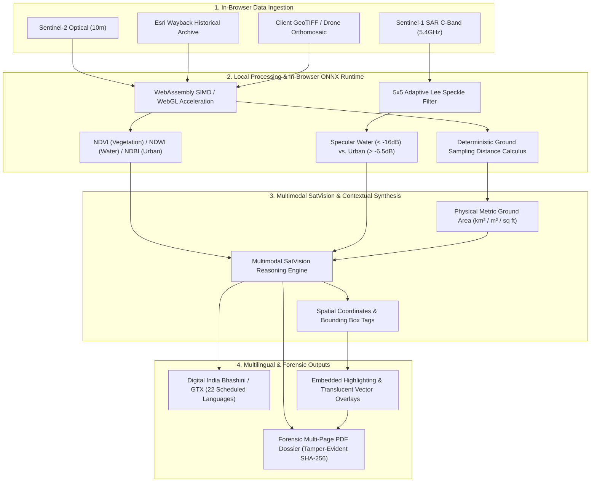

<div align="center">
  

  # 🛰️ VYOMIX · Earth Query Lens
  ### Multimodal Satellite Intelligence · Dual-Spectrum Radar Fusion · 22-Language Indic Remote Sensing

  **Smart India Hackathon 2026 (SIH 2026)** · Engineered by **Shreyas J** ([@SmartKidzee](https://github.com/SmartKidzee)) & The Vyomix Team

  <br />

  <!-- Animated Tech Badges -->
  <p align="center">
    <a href="https://github.com/SmartKidzee/vyomixsih"></a>
    <a href="LICENSE"></a>
    <a href="#"></a>
    <a href="#"></a>
    <a href="#"></a>
    <a href="#"></a>
    <a href="#"></a>
    <a href="SECURITY.md"></a>
  </p>

  <br />

  <!-- Animated Glowing Typing Banner -->
  <a href="#">
    
  </a>

  <br />

  <p align="center">
    <a href="#-executive-overview">Overview</a> •
    <a href="#-dual-spectrum-radar--optical-architecture">Architecture</a> •
    <a href="#-forensic-pdf-dossier-engine">PDF Dossiers</a> •
    <a href="#-indic-voice--22-languages">22 Indic Languages</a> •
    <a href="#-free-satellite-data-sources">Free Basemaps</a> •
    <a href="#-installation--local-setup">Quickstart</a> •
    <a href="#-community--governance">Community</a> •
    <a href="#-license--mandatory-attribution">Attribution</a>
  </p>
</div>

<div align="center">
  
</div>

---

## 🌟 Executive Overview

**Vyomix · Earth Query Lens** is an operational-grade Earth observation AI platform designed for defense reconnaissance, disaster relief operations, environmental forensics, and municipal land-auditing. Engineered for the **Smart India Hackathon (SIH 2026)**, it overcomes the critical vulnerability of traditional optical satellites: **dense cloud cover, monsoon rain, smoke, and nighttime occlusion**.

By fusing **high-resolution optical imagery** with **Synthetic Aperture Radar (SAR C-Band)**, Vyomix pierces cloud decks and weather disturbances. The platform executes neural classification in-browser via **WebAssembly SIMD**, eliminates hallucinated measurements through **deterministic Ground Sampling Distance (GSD) calculus**, provides **Indic voice dictation in 22 languages**, and compiles **multi-page tamper-evident forensic PDF dossiers** with embedded highlighted overlays.

> [!TIP]
> **Zero Subscription Fees & Local-First Privacy**: Baseline satellite datasets (Sentinel-1 SAR, Sentinel-2 Optical, NASA MODIS, Esri Wayback), in-browser ONNX neural tensors, and EuroSAT spectral partitioning operate without mandatory paywalls, proprietary subscriptions, or external telemetry leaks.

---

## 🛰️ Dual-Spectrum Radar & Optical Architecture



---

## 🔬 Core Technological Breakthroughs

### 1. Dual-Spectrum Radar Fusion (Optical + SAR C-Band)
- **Monsoon & Cloud Penetration:** Fuses Sentinel-2 RGB/NIR optical bands with Sentinel-1 microwave Synthetic Aperture Radar (C-Band, 5.405 GHz). Penetrates monsoon downpours, sea fog, and nighttime conditions for continuous 24/7 mission readiness.
- **Adaptive 5×5 Lee Speckle Filter:** Suppresses multiplicative radar speckle noise using moving-window local mean and variance kernels while strictly preserving high-contrast structural edges, airport runways, and coastal bridges.
- **Dielectric Signature Delineation:** Delineates specular water reflections ($< -16\text{ dB}$) from double-bounce urban dielectric reflections ($> -6.5\text{ dB}$) to detect floodwaters even when obscured by tree canopies.

### 2. Deterministic Physical Ground Area Calculus
- **Ground Sampling Distance (GSD) Physics:** Directly calculates true ground surface area ($\pm\text{ km}^2$, $\text{m}^2$, $\text{sq ft}$) from sensor geometry and pixel bounding metrics ($10\text{ m/px}$ Sentinel-2, $30\text{ m/px}$ Landsat, sub-meter commercial passes).
- **Mathematical Ground Truth:** Eliminates generative model guessing by enforcing strict trigonometric and pixel-density verification.

### 3. Forensic PDF Dossier Engine with Embedded Overlays
- **Chronological Chat Interrogation History:** Compiles all conversational exchanges, queries, and assistant analyses in chronological order.
- **Embedded Satellite Imagery & Highlights:**
  - Draws all uploaded satellite scenes directly into vector PDF documents.
  - Automatically renders highlighted bounding box passes with translucent color-coded fills, spatial tags, and confidence scores onto high-resolution canvases.
- **Cryptographic Audit Seal:** Embeds a deterministic `VYX-SHA256-...` audit hash and letterhead classification (`OFFICIAL FORENSIC RECORD`) for regulatory and evidentiary workflows.

### 4. Native Indic Multilingual Voice Engine (22 Languages)
- **Universal Translation Pipeline:** Powered by Google Translate GTX & Digital India's Bhashini ULCA services for zero-latency translation across all 22 scheduled Indian languages:
  - हिन्दी (Hindi), ಕನ್ನಡ (Kannada), தமிழ் (Tamil), తెలుగు (Telugu), বাংলা (Bengali), मराठी (Marathi), ગુજરાતી (Gujarati), മലയാളം (Malayalam), ਪੰਜਾਬੀ (Punjabi), ଓଡ଼ିଆ (Odia), অসমীয়া (Assamese), اردو (Urdu), etc.
- **Voice Speech-to-Text (STT) & Auditory Readout (TTS):** Natural voice interrogation with automated Indic script transliteration.

### 5. In-Browser ONNX Neural Inference (`onnxruntime-web`)
- **100% Client-Side Local Execution:** Executes neural tensors and radiometric processing directly inside the browser using WebAssembly SIMD and WebGL acceleration. Zero server roundtrips, zero API token costs, and fully offline capable.
- **Spectral Land-Cover Partitioning:** Computes NDVI (Vegetation Canopy), NDWI (Water Inundation), and NDBI (Urban Sprawl) with exact percentage splits.

### 6. 12+ Year Esri Wayback Satellite Archives (2014–2026)
- **Interactive Bi-Temporal Curtain Slider:** Compare baseline passes against post-event imagery over an interactive split view with NASA MODIS and VIIRS thermal telemetry.
- **Automated Two-View Capture:** One-click automated capture of both Left and Right epochs directly into the analytical prompt pipeline.

---

## 🎨 UI/UX Design System

<div align="center">
  <table>
    <tr>
      <td width="50%">
        <h4>✨ AeroShards Reactive Hero</h4>
        <p>Dynamic WebGL/WebGPU shard stream responding to mouse proximity with fluid physics. Features dedicated portrait-mode aspect scaling (<code>aspect &lt; 0.82</code>) and 60fps 2D Canvas fallback for mobile phones.</p>
      </td>
      <td width="50%">
        <h4>🧭 Floating Pill Navigation Bar</h4>
        <p>Centered glassmorphic pill navbar with curved ends, backdrop blur, integrated 22-language switcher, and responsive viewports for iOS and Android devices.</p>
      </td>
    </tr>
    <tr>
      <td width="50%">
        <h4>💬 Clean Prose Chat Experience</h4>
        <p>Uncluttered conversational flow inspired by ChatGPT and Claude. Zero AI slop, top-aligned avatars, one-click clipboard copying, and voice read-aloud playback.</p>
      </td>
      <td width="50%">
        <h4>📜 ScrollExpand Viewport Transition</h4>
        <p>Immersive scroll-pinned satellite unfolding animation guiding users from landing presentation into operational analytics studio.</p>
      </td>
    </tr>
  </table>
</div>

---

## 🌐 Free Satellite Data Ecosystem

You can download real test data for free without credit cards from these official portals:

| Source | Modality | Best For | Direct Portal Link |
| :--- | :--- | :--- | :--- |
| **Copernicus Browser** | **Sentinel-1 SAR** & **Sentinel-2 Optical** | High-Res PNGs or 16-bit GeoTIFFs across any city, river, or coastline | [browser.dataspace.copernicus.eu](https://browser.dataspace.copernicus.eu/) |
| **ASF Vertex** (NASA / Alaska Satellite Facility) | **Sentinel-1 C-Band SAR** | Calibrated GRD radar amplitudes, interferometric pairs | [search.asf.alaska.edu](https://search.asf.alaska.edu/) |
| **USGS EarthExplorer** | **Landsat 8/9 & Sentinel Optical** | Multi-decade multispectral archives and global DEM elevation | [earthexplorer.usgs.gov](https://earthexplorer.usgs.gov/) |
| **EuroSAT Dataset** | **Sentinel-2 Multi-Spectral** | 27,000 labeled patches across 10 land-cover categories | [huggingface.co/datasets/blanchon/EuroSAT_RGB](https://huggingface.co/datasets/blanchon/EuroSAT_RGB) |

---

## 📁 Repository Structure

```
earth-query-lens/
├── .github/
│   ├── ISSUE_TEMPLATE/
│   │   ├── bug_report.md        # Structured bug report template
│   │   ├── feature_request.md   # Operational feature proposal template
│   │   └── config.yml           # Issue config linking private advisories
│   ├── CODE_OF_CONDUCT.md       # Contributor Covenant v2.1
│   ├── CONTRIBUTING.md          # Developer setup, conventions, & testing
│   ├── PULL_REQUEST_TEMPLATE.md # PR verification checklist
│   └── SUPPORT.md               # Support resources & advisory contacts
├── public/                      # Static assets, logos, and Cesium workers
│   ├── logo.svg                 # Vyomix orbital logo
│   └── earth-hero.jpg           # High-resolution satellite orbital imagery
├── src/
│   ├── components/              # Reusable UI & GIS components
│   │   ├── reactbits/           # AeroShards, ScrollExpand, MagicBento
│   │   ├── ChatShareModal.tsx   # Full chat PDF export dialog
│   │   ├── LanguageSwitcher.tsx # 22-language switcher dropdown
│   │   ├── MapSelector.tsx      # CesiumJS 3D globe & bi-temporal slider
│   │   └── BackendSettings.tsx  # Dual API key configuration
│   ├── lib/
│   │   ├── i18n.tsx             # Auto-translating reactive i18n system
│   │   ├── satquery.ts          # GSD calculus & spectral telemetry types
│   │   └── onnxInference.ts     # In-browser WebAssembly ONNX inference
│   ├── routes/
│   │   ├── HomePage.tsx         # Landing page with floating pill nav & bento
│   │   └── index.tsx            # Main conversational geospatial studio
│   ├── services/
│   │   ├── pdfReportService.ts  # Vector PDF generator with images & highlights
│   │   ├── translationService.ts# Google GTX & progressive cache
│   │   ├── geminiService.ts     # Multimodal SatVision reasoning pool
│   │   └── ttsService.ts        # Indic STT voice dictation & TTS audio
│   ├── App.tsx                  # App entrypoint & routing
│   └── main.tsx                 # Root render tree
├── LICENSE                      # MIT License with Mandatory Attribution
├── SECURITY.md                  # Security policy & zero-telemetry disclosure
├── package.json                 # Dependencies & scripts
└── vite.config.ts               # Vite 6 + Cesium + Tailwind v4 config
```

---

## 🛠️ Installation & Local Setup

### Prerequisites
- **Node.js**: `v18.0.0` or higher (`v20+` LTS recommended)
- **npm**: `v9.0.0` or higher

### 1. Clone the Repository
```bash
git clone https://github.com/SmartKidzee/vyomixsih.git
cd vyomixsih
```

### 2. Install Dependencies
```bash
npm install
```

### 3. Run Development Server
```bash
npm run dev
```
Open your browser at `http://localhost:5173` to explore the Vyomix studio.

### 4. Build for Production
```bash
npm run build
npm run preview
```

---

## 🔒 Security & Privacy

Vyomix adheres to strict local-first and zero-retention principles:
- **Local-First Processing:** Neural inference runs inside the user's browser via WebAssembly (`onnxruntime-web`).
- **Zero Remote Storage:** Uploaded satellite rasters are stored exclusively in volatile browser memory and client-side IndexedDB.
- **Cryptographic Document Auditing:** All generated PDF reports contain tamper-evident SHA-256 verification seals.

For complete vulnerability reporting guidelines, consult [SECURITY.md](SECURITY.md).

---

## 🤝 Community & Governance

We maintain an active, welcoming, and professional open-source community:

- **[Code of Conduct](.github/CODE_OF_CONDUCT.md):** Contributor Covenant v2.1 standards.
- **[Contributing Guidelines](.github/CONTRIBUTING.md):** Development workflows, branching strategies, and Conventional Commit guidelines.
- **[Pull Request Template](.github/PULL_REQUEST_TEMPLATE.md):** Verification checklist for submitting pull requests.
- **[Support Center](.github/SUPPORT.md):** Documentation links, discussion channels, and help resources.
- **[Security Policy](SECURITY.md):** Confidential vulnerability disclosure via GitHub Private Advisories.

---

## 📜 License & Mandatory Attribution

This project is licensed under the **MIT License with Mandatory Attribution Clause**.

**Author & Owner:** **Shreyas J**  
**GitHub:** [@SmartKidzee](https://github.com/SmartKidzee)  
**Team:** The Vyomix Team · **Smart India Hackathon (SIH 2026)**  

### Attribution Requirement
Any public fork, commercial offering, deployed instance, or derivative work based upon this repository **MUST** prominently attribute the original creator:
> *"Original project developed by Shreyas J (github.com/SmartKidzee) and the Vyomix Team for Smart India Hackathon (SIH 2026)"*

See the full [LICENSE](LICENSE) file for legal details.

<div align="center">
  
</div>
